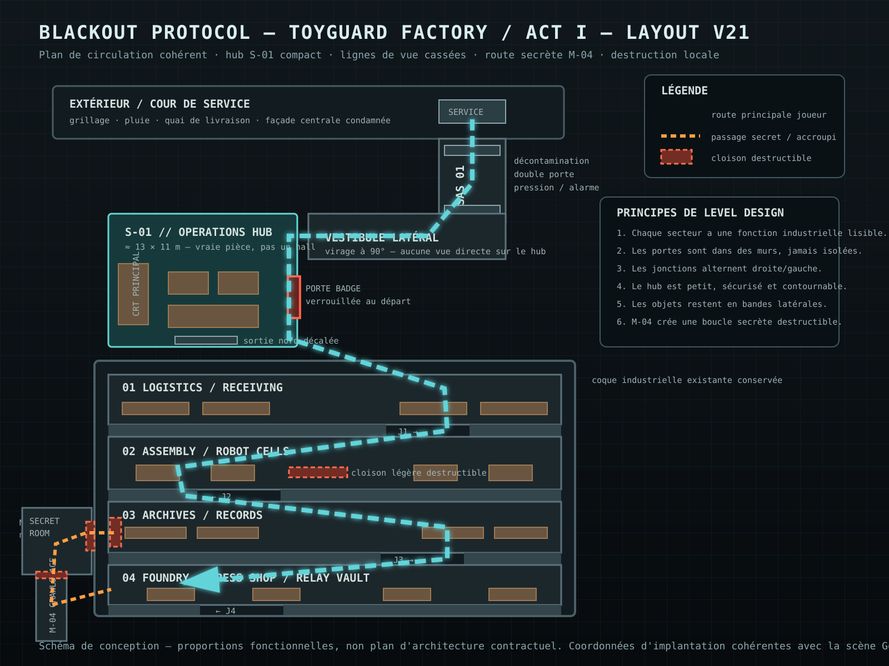
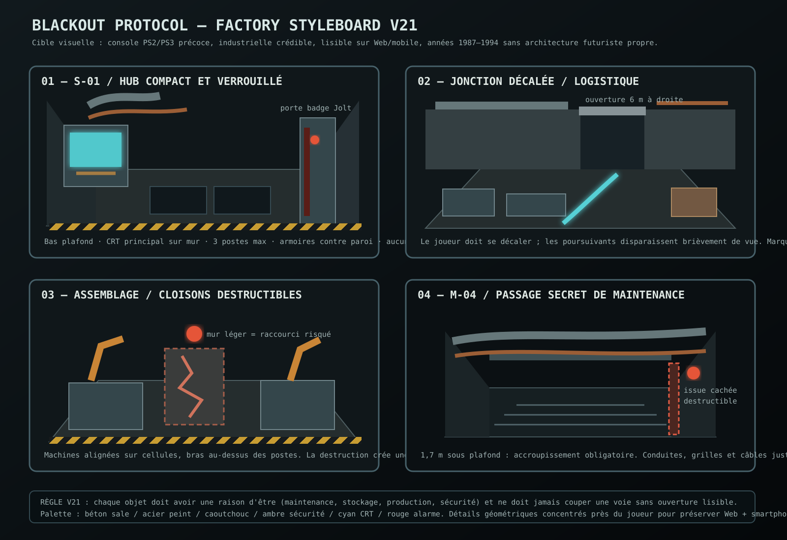

# Factory Layout v21 — coherent industrial horror space

## Objective

Replace the previous straight-through factory impression with a readable industrial complex that still runs on Godot 4.7, Jolt, Web and mobile. The change is spatial and surgical: mission systems, robots, destruction, KITE-01, Sentinel, ATHENA and the current Act I canon are retained.

## Beta-test diagnosis

The v20 environment was tested from three complementary player profiles using the actual scene structure and the existing Godot integration harness.

| Profile | Behaviour | v20 problem | v21 correction |
| --- | --- | --- | --- |
| Explorer | inspects rooms, props, signs and secondary edges | rooms read as successive slices of one long hall | alternating offset junctions, semantic signage and a genuine secret loop |
| Cautious survivor | moves slowly, uses corners and sightlines | long north/south views reveal threats too early | bulkheads alternate right/left and break sightlines without maze-like confusion |
| Speedrunner | follows objective markers and shortest geometric route | almost every objective remains reachable on the central axis | route now requires lateral displacement at J1–J4; shortcuts require destruction or crouching |

A specific v20 blocker was also identified in `_build_props()`: eight rigid props were placed transversely around `z=-55`, from approximately `x=-5` to `x=+5.5`. The v21 pass detects and relocates those bodies into wall-side storage positions. The previous central archive shelves and the oversized assembly partition are also removed or replaced by structures with explicit openings.

## Spatial storyboard

The player still arrives outside ToyGuard and enters through the existing lateral service access. The decontamination airlock and blast door remain the first transition. The lateral vestibule then turns the player west toward a compact S-01 operations room rather than exposing the entire factory.

S-01 is approximately 13 × 11 m in the corrective layout. The main supervision screen remains on the west wall, workstations are pushed against the perimeter, and the connection to the vestibule is controlled by a physical Jolt gate. The gate starts locked. Approaching the reader and pressing `E` validates the technician badge; only then can the sliding collision body open. This makes the room feel secured without adding an inventory dependency that would break the existing first-round flow.

Leaving the hub sends the player into Logistics. Four cross-bulkheads then divide the long shell into spatial beats. Their openings alternate right, left, right, left at approximately `z=-22.5`, `-58`, `-92` and `-126`. Each opening is wider than the standing player capsule and is checked in CI. This preserves readable navigation for pursuit while removing the 176 m visual tunnel.

Assembly keeps machines on working cells rather than in arbitrary circulation lanes. A light destructible partition provides a risk/reward shortcut. Archives retain side storage while the former central shelf obstruction is removed. The existing secret room becomes useful: its rear wall now has a second destructible threshold leading to M-04, a low maintenance crawlspace. M-04 is intentionally too low to traverse standing, uses the existing crouch mechanic, and rejoins the deeper factory near the foundry. It therefore creates a loop rather than a dead end.

Foundry remains the dangerous late-industrial sector and preserves the relay objective. Heavy presses stay in large cells with circulation around them; they are not used as corridor walls.

## Environment rules

1. A door must belong to a wall, frame, airlock or machine enclosure; no isolated door may be placed in a walk lane.
2. Main circulation must maintain a standing clearance; maintenance crawlspaces may intentionally require crouching.
3. Static storage and decorative props belong to wall strips, racks, work cells or marked staging areas, not the navigation spine.
4. Long sightlines are broken by credible bulkheads, vestibules or equipment zones rather than arbitrary walls.
5. Destruction targets non-load-bearing partitions, access panels, glazing and service closures. Structural shell walls remain protected.
6. Secret routes must reconnect to another meaningful sector and create a tactical loop.
7. Visual density is concentrated near walls and interaction areas to keep the Compatibility renderer suitable for Web/mobile.

## Implementation

The corrective layer is implemented in `scripts/visual/factory_layout_v21.gd`. It runs after the v20 industrial visual layer, removes only known problematic connectors/obstacles, and then builds the new hub, junctions, secret route and wayfinding. `scripts/visual/secure_hub_gate_v21.gd` owns the secured sliding gate.

The active campaign integration is in `src_parts/main_20_visual_quality.gdpart`. The build pipeline still concatenates the `src_parts` into `scripts/main.gd`, so no second game path is introduced.

`tests/test_visual_mobile.gd` now checks that the v21 layout exists, the S-01 gate starts locked, authorization changes state, all J1–J4 standing waypoints remain collision-free, and the M-04 route is clear for the crouched capsule. When run with a graphical display, the same test captures exterior, airlock, compact hub, logistics junction, assembly, secret room and crawlspace views into `build/visual-v21/`.

## Canon note

The active Act I remains ToyGuard Industries / ATHENA / Alex Mercer. The historical Project Daedalus / DAEDALUS / Paul Merrick / Salle Hermès material remains suitable for the later chapter already described in the repository. The spatial design developed here can be reused for Hermès when that chapter is activated, but the current scene deliberately calls the secure room **S-01 Operations Hub** to avoid mixing both story eras.
